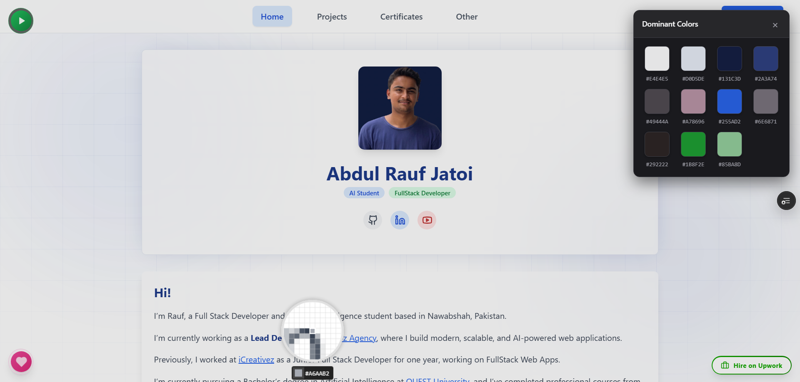
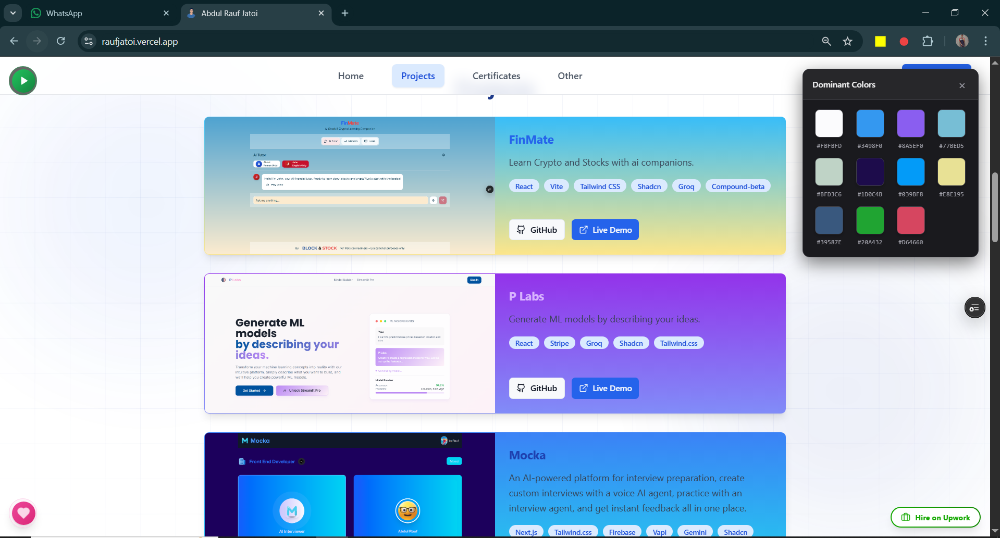

# 🎨 Color Picker R

### Pick colors from any webpage with ease. Simple, fast, and casual! 🚀

Color Picker R is a Chrome extension designed for designers, developers, and color enthusiasts. Whether you need to grab a specific HEX code from a pixel or extract the entire color palette of a beautiful website, we've got you covered.

---

## ✨ Features

*   **🔍 Precision Eyedropper**: Zoom in and pick the perfect color with our magnifier lens.
*   **🎨 Color Extraction**: One click to extract the dominant color palette from any page using K-means clustering.
*   **📋 Instant Copy**: Click any color to copy the HEX code straight to your clipboard.
*   **🌙 Dark Mode**: A sleek, minimal UI that stays out of your way.

---

## 📸 See it in Action

  
<b>The main dashboard</b>

  

 

<b>📐 Click here to see the Magnifier Lens & More! (Gallery)</b>

 

  
<b>Precision picking with the magnifier</b>

  
  

  
<b>Extracting dominant colors (Simple Mode)</b>

  
  

  
<b>Extracting colors from complex sites</b>

  

---

## 🚀 How to Install

1.  Download or clone this repo.
2.  Open Chrome and go to `chrome://extensions/`.
3.  Enable **Developer mode** (top right).
4.  Click **Load unpacked** and select the project folder.
5.  Start picking colors! 🎨

---

  
Made with ❤️ by Rauf Jatoi

